# ProofPocket: UML diagrams

> **For Claude (chat):** turn this file into a well-formatted document called "ProofPocket: System design (UML)". Keep every diagram, render each Mermaid block as a diagram, and keep the short explanation above each one. Number the figures (Figure 1, Figure 2…) and add a table of contents. Don't change what the diagrams say. They describe the real, built system.

**System in one line:** ProofPocket is one shared business record for young founders and township or rural businesses, their incubators, funders, buyers, clients and the public. It never holds or moves money: clients pay founders directly, and ProofPocket records payments and checks proofs.

**Built with:**
- **Web:** React PWA.
- **API:** Node.js and Express on Google Cloud Run.
- **Database:** PostgreSQL 18 on Cloud SQL, with row-level security.
- **File storage:** a private Cloud Storage bucket.
- **Sign-in:** Firebase Authentication, plus Google Authenticator for two-step sign-in.
- **Hosting:** the web app on Firebase Hosting. Everything else runs in Google Cloud **africa-south1 (Johannesburg)**.

## Contents

1. Use case diagram
2. Component diagram
3. Deployment diagram
4. Domain class diagram
5. Entity-relationship diagram
6. Sequence diagrams
   - 6.1 Sign-in with two-step sign-in
   - 6.2 How every API request is authorised
   - 6.3 Joining and document upload
   - 6.4 Document check and becoming Verified
   - 6.5 Payment request, proof and confirmation
   - 6.6 Offline bookkeeping and sync
   - 6.7 Funding: apply, offer and decision
   - 6.8 Changing payment details
   - 6.9 POPIA data request
   - 6.10 Daily scheduled job
7. State machine diagrams
   - 7.1 Payment request
   - 7.2 Proof of payment
   - 7.3 Document
   - 7.4 Company verification
   - 7.5 Funding application
   - 7.6 Incubator membership
   - 7.7 Supplier bank detail change
   - 7.8 Post feature request
   - 7.9 Report and data request
8. Activity diagrams
   - 8.1 Readiness score
   - 8.2 Applying to a funding programme
   - 8.3 Recording a money-out entry

---

## 1. Use case diagram

Who uses ProofPocket and what each of them can do. Mermaid has no native use-case notation, so actors are drawn as rounded nodes and use cases as ovals.

```mermaid
flowchart LR
  Founder([Founder])
  Client([Client / payer])
  Adviser([Incubator adviser])
  Funder([Funder])
  Admin([ProofPocket admin])
  Public([Public visitor])
  Job([Scheduled job])

  subgraph PP[ProofPocket]
    UC1((Join and upload documents))
    UC2((Keep books, stock and suppliers))
    UC3((Import bank statement CSV))
    UC4((Create payment request))
    UC5((Confirm or reject proof of payment))
    UC6((Save payment details))
    UC7((Check a suspicious message))
    UC8((Choose funder sharing))
    UC9((Download my data / data request))
    UC10((Build profile and share posts))
    UC11((Apply for funding))
    UC12((Express interest in tenders))
    UC13((Pay and send proof of payment))
    UC14((Report a request or business))
    UC15((Check documents))
    UC16((Move cohort through support stages))
    UC17((Log support))
    UC18((Set programme requirements))
    UC19((Review pipeline and applications))
    UC20((Make or change offers with reasons))
    UC21((Verify organisations and invite users))
    UC22((Handle reports and data requests))
    UC23((Review feature requests))
    UC24((Review flagged payments and scam senders))
    UC25((Manage tenders and buyers))
    UC26((Browse directory and profiles))
    UC27((Sign in with two-step sign-in))
    UC28((Expire requests and documents, check integrity))
  end

  Founder --- UC1 & UC2 & UC3 & UC4 & UC5 & UC6 & UC7 & UC8 & UC9 & UC10 & UC11 & UC12 & UC27
  Client --- UC13 & UC14
  Adviser --- UC15 & UC16 & UC17 & UC27
  Funder --- UC18 & UC19 & UC20 & UC27
  Admin --- UC15 & UC21 & UC22 & UC23 & UC24 & UC25 & UC27
  Public --- UC26 & UC14
  Job --- UC28
```

---

## 2. Component diagram

The main software parts and how they depend on each other. Business rules live in one shared package used by both the web app and the API; the API's answer is authoritative.

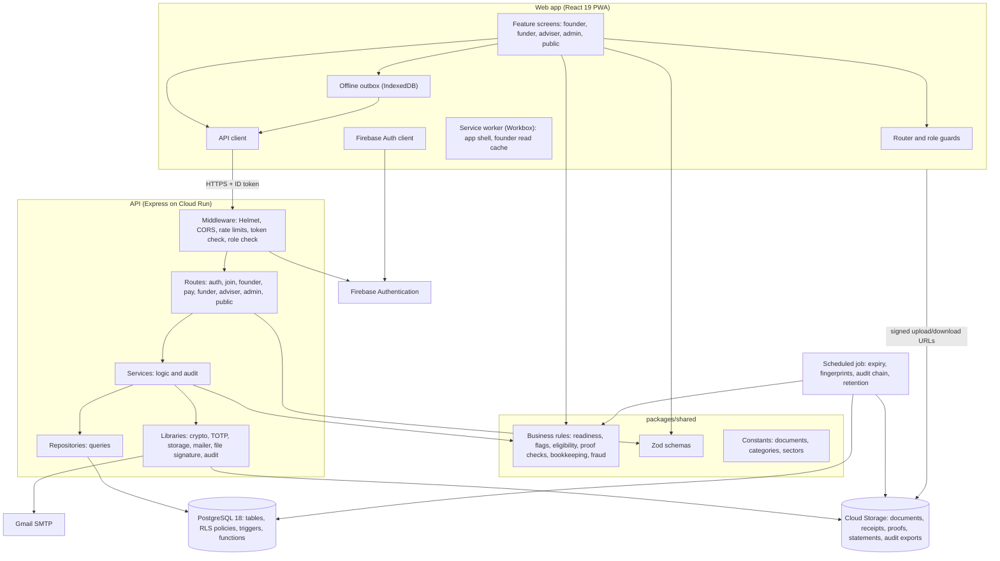
```mermaid
flowchart TB
  subgraph Web["Web app (React 19 PWA)"]
    Router[Router and role guards]
    Features["Feature screens: founder, funder, adviser, admin, public"]
    ApiClient[API client]
    Outbox["Offline outbox (IndexedDB)"]
    SW["Service worker (Workbox): app shell, founder read cache"]
    AuthClient[Firebase Auth client]
  end

  subgraph Shared["packages/shared"]
    Rules["Business rules: readiness, flags, eligibility, proof checks, bookkeeping, fraud"]
    Schemas[Zod schemas]
    Constants["Constants: documents, categories, sectors"]
  end

  subgraph API["API (Express on Cloud Run)"]
    Middleware["Middleware: Helmet, CORS, rate limits, token check, role check"]
    Routes["Routes: auth, join, founder, pay, funder, adviser, admin, public"]
    Services["Services: logic and audit"]
    Repos[Repositories: queries]
    Libs["Libraries: crypto, TOTP, storage, mailer, file signature, audit"]
  end

  DB[("PostgreSQL 18: tables, RLS policies, triggers, functions")]
  Bucket[("Cloud Storage: documents, receipts, proofs, statements, audit exports")]
  Firebase[Firebase Authentication]
  Mail[Gmail SMTP]
  Jobs["Scheduled job: expiry, fingerprints, audit chain, retention"]

  Features --> Router
  Features --> ApiClient
  Features --> Outbox
  Outbox --> ApiClient
  Features --> Rules
  Features --> Schemas
  AuthClient --> Firebase
  ApiClient -->|HTTPS + ID token| Middleware
  Middleware --> Routes --> Services --> Repos --> DB
  Routes --> Schemas
  Services --> Rules
  Services --> Libs
  Libs --> Bucket
  Libs --> Mail
  Middleware --> Firebase
  Web -->|signed upload/download URLs| Bucket
  Jobs --> DB
  Jobs --> Bucket
  Jobs --> Rules
```

---

## 3. Deployment diagram

Where everything runs. The database has only a private IP address. The API reaches it through the VPC, over TLS, and checks the server certificate.

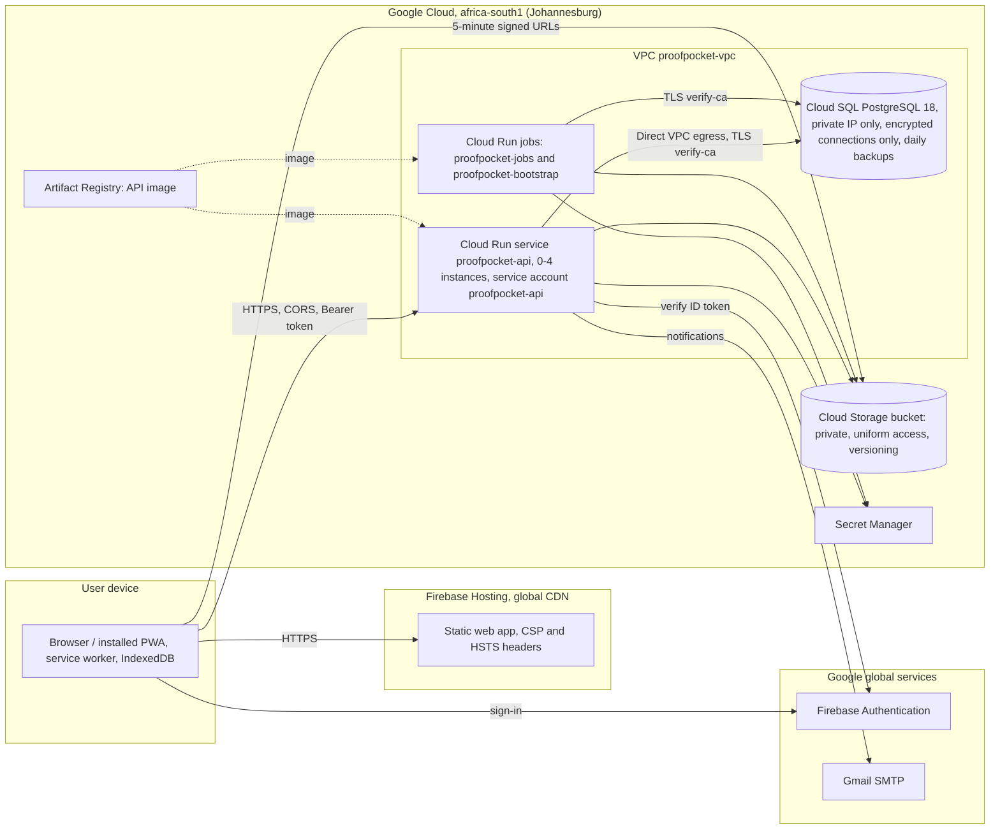
```mermaid
flowchart LR
  subgraph Device[User device]
    Browser["Browser / installed PWA, service worker, IndexedDB"]
  end

  subgraph FBH[Firebase Hosting, global CDN]
    Static["Static web app, CSP and HSTS headers"]
  end

  subgraph GCP["Google Cloud, africa-south1 (Johannesburg)"]
    subgraph VPC["VPC proofpocket-vpc"]
      Run["Cloud Run service proofpocket-api, 0-4 instances, service account proofpocket-api"]
      RunJobs["Cloud Run jobs: proofpocket-jobs and proofpocket-bootstrap"]
      SQL[("Cloud SQL PostgreSQL 18, private IP only, encrypted connections only, daily backups")]
    end
    GCS[("Cloud Storage bucket: private, uniform access, versioning")]
    SM[Secret Manager]
    AR[Artifact Registry: API image]
  end

  subgraph Google[Google global services]
    FAuth[Firebase Authentication]
    Gmail[Gmail SMTP]
  end

  Browser -->|HTTPS| Static
  Browser -->|HTTPS, CORS, Bearer token| Run
  Browser -->|5-minute signed URLs| GCS
  Browser -->|sign-in| FAuth
  Run -->|Direct VPC egress, TLS verify-ca| SQL
  RunJobs -->|TLS verify-ca| SQL
  Run --> GCS
  RunJobs --> GCS
  Run --> SM
  RunJobs --> SM
  Run -->|verify ID token| FAuth
  Run -->|notifications| Gmail
  AR -.->|image| Run
  AR -.->|image| RunJobs
```

---

## 4. Domain class diagram

The main business objects, their key attributes and relationships. Statuses are shown as enumerations.

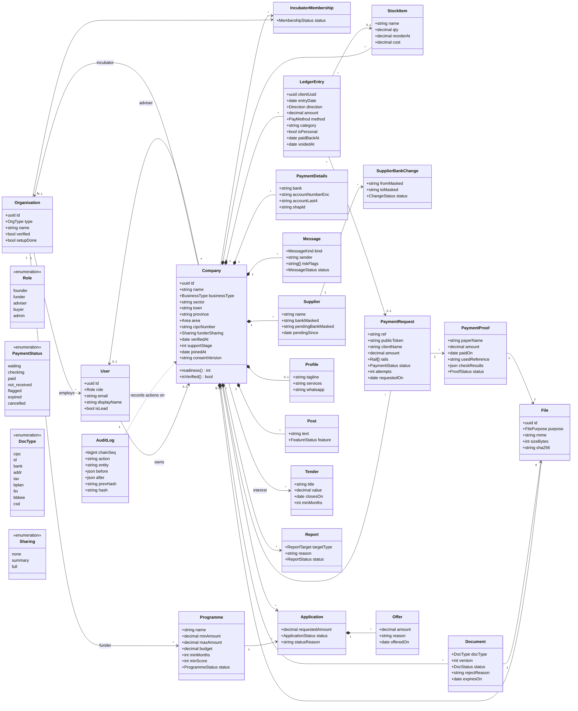
```mermaid
classDiagram
  direction LR

  class Organisation {
    +uuid id
    +OrgType type
    +string name
    +bool verified
    +bool setupDone
  }
  class User {
    +uuid id
    +Role role
    +string email
    +string displayName
    +bool isLead
  }
  class Company {
    +uuid id
    +string name
    +BusinessType businessType
    +string sector
    +string town
    +string province
    +Area area
    +string cipcNumber
    +Sharing funderSharing
    +date verifiedAt
    +int supportStage
    +date joinedAt
    +string consentVersion
    +readiness() int
    +isVerified() bool
  }
  class IncubatorMembership {
    +MembershipStatus status
  }
  class File {
    +uuid id
    +FilePurpose purpose
    +string mime
    +int sizeBytes
    +string sha256
  }
  class Document {
    +DocType docType
    +int version
    +DocStatus status
    +string rejectReason
    +date expiresOn
  }
  class LedgerEntry {
    +uuid clientUuid
    +date entryDate
    +Direction direction
    +decimal amount
    +PayMethod method
    +string category
    +bool isPersonal
    +date paidBackAt
    +date voidedAt
  }
  class StockItem {
    +string name
    +decimal qty
    +decimal reorderAt
    +decimal cost
  }
  class Supplier {
    +string name
    +string bankMasked
    +string pendingBankMasked
    +date pendingSince
  }
  class SupplierBankChange {
    +string fromMasked
    +string toMasked
    +ChangeStatus status
  }
  class PaymentDetails {
    +string bank
    +string accountNumberEnc
    +string accountLast4
    +string shapId
  }
  class PaymentRequest {
    +string ref
    +string publicToken
    +string clientName
    +decimal amount
    +Rail[] rails
    +PaymentStatus status
    +int attempts
    +date requestedOn
  }
  class PaymentProof {
    +string payerName
    +decimal amount
    +date paidOn
    +string usedReference
    +json checkResults
    +ProofStatus status
  }
  class Message {
    +MessageKind kind
    +string sender
    +string[] riskFlags
    +MessageStatus status
  }
  class Programme {
    +string name
    +decimal minAmount
    +decimal maxAmount
    +decimal budget
    +int minMonths
    +int minScore
    +ProgrammeStatus status
  }
  class Application {
    +decimal requestedAmount
    +ApplicationStatus status
    +string statusReason
  }
  class Offer {
    +decimal amount
    +string reason
    +date offeredOn
  }
  class Profile {
    +string tagline
    +string services
    +string whatsapp
  }
  class Post {
    +string text
    +FeatureStatus feature
  }
  class Tender {
    +string title
    +decimal value
    +date closesOn
    +int minMonths
  }
  class Report {
    +ReportTarget targetType
    +string reason
    +ReportStatus status
  }
  class AuditLog {
    +bigint chainSeq
    +string action
    +string entity
    +json before
    +json after
    +string prevHash
    +string hash
  }

  Organisation "1" --> "*" User : employs
  User "1" --> "0..1" Company : owns
  Organisation "1" --> "*" IncubatorMembership
  Company "1" --> "*" IncubatorMembership
  Company "*" --> "0..1" Organisation : incubator
  Company "*" --> "0..1" User : adviser
  Company "1" *-- "*" File
  Company "1" *-- "*" Document
  Document "1" --> "1" File
  Company "1" *-- "*" LedgerEntry
  Company "1" *-- "*" StockItem
  Company "1" *-- "*" Supplier
  Supplier "1" --> "*" SupplierBankChange
  Company "1" *-- "*" PaymentDetails
  Company "1" *-- "*" PaymentRequest
  PaymentRequest "1" --> "*" PaymentProof
  PaymentProof "1" --> "1" File
  LedgerEntry "*" --> "0..1" PaymentRequest
  LedgerEntry "*" --> "0..1" StockItem
  Company "1" *-- "*" Message
  Organisation "1" --> "*" Programme : funder
  Programme "1" --> "*" Application
  Company "1" --> "*" Application
  Application "1" *-- "*" Offer
  Company "1" *-- "0..1" Profile
  Company "1" *-- "*" Post
  Company "*" --> "*" Tender : interest
  Company "1" --> "*" Report
  AuditLog ..> Company : records actions on

  class Role {
    <<enumeration>>
    founder
    funder
    adviser
    buyer
    admin
  }
  class PaymentStatus {
    <<enumeration>>
    waiting
    checking
    paid
    not_received
    flagged
    expired
    cancelled
  }
  class DocType {
    <<enumeration>>
    cipc
    id
    bank
    addr
    tax
    bplan
    fin
    bbbee
    csd
  }
  class Sharing {
    <<enumeration>>
    none
    summary
    full
  }
```

---

## 5. Entity-relationship diagram

The main database tables and their keys. Every table has row-level security switched on.

```mermaid
erDiagram
  ORGANISATIONS ||--o{ USERS : "org_id"
  USERS ||--o| COMPANIES : "owner_id"
  ORGANISATIONS ||--o{ COMPANIES : "incubator_id"
  COMPANIES ||--o{ INCUBATOR_MEMBERSHIPS : has
  ORGANISATIONS ||--o{ INCUBATOR_MEMBERSHIPS : has
  COMPANIES ||--o{ FILES : stores
  COMPANIES ||--o{ DOCUMENTS : has
  FILES ||--o| DOCUMENTS : "file_id"
  COMPANIES ||--o{ LEDGER_ENTRIES : records
  COMPANIES ||--o{ STOCK_ITEMS : holds
  STOCK_ITEMS ||--o{ STOCK_MOVEMENTS : moves
  COMPANIES ||--o{ SUPPLIERS : has
  SUPPLIERS ||--o{ SUPPLIER_BANK_CHANGES : has
  COMPANIES ||--o{ STATEMENT_IMPORTS : imports
  STATEMENT_IMPORTS ||--o{ STATEMENT_LINES : contains
  COMPANIES ||--o{ MONTHLY_HISTORY : has
  COMPANIES ||--o{ PAYMENT_DETAILS : saves
  COMPANIES ||--o{ PAYMENT_REQUESTS : creates
  PAYMENT_REQUESTS ||--o{ PAYMENT_PROOFS : receives
  FILES ||--o| PAYMENT_PROOFS : "file_id"
  PAYMENT_REQUESTS ||--o{ LEDGER_ENTRIES : "settles"
  COMPANIES ||--o{ MESSAGES : receives
  COMPANIES ||--o| PROFILES : has
  COMPANIES ||--o{ POSTS : writes
  ORGANISATIONS ||--o{ PROGRAMMES : "funder_id"
  PROGRAMMES ||--o{ PROGRAMME_REQUIREMENTS : requires
  PROGRAMMES ||--o{ APPLICATIONS : receives
  COMPANIES ||--o{ APPLICATIONS : submits
  APPLICATIONS ||--o{ OFFERS : "append-only"
  COMPANIES ||--o{ SUPPORT_LOGS : "logged for"
  TENDERS ||--o{ TENDER_REQUIREMENTS : requires
  TENDERS ||--o{ TENDER_INTERESTS : receives
  COMPANIES ||--o{ TENDER_INTERESTS : expresses
  COMPANIES ||--o{ INTRO_REQUESTS : asks
  ORGANISATIONS ||--o{ INTRO_REQUESTS : "buyer_id"
  COMPANIES ||--o{ REPORTS : "about"
  USERS ||--o| USER_TOTP : "two-step secret"
  COMPANIES ||--o{ ACTIVITY : timeline
  COMPANIES ||--o{ AUDIT_LOG : "company_id"

  USERS {
    uuid id PK
    enum role
    text email
    uuid org_id FK
    text firebase_uid
  }
  COMPANIES {
    uuid id PK
    uuid owner_id FK
    text name
    enum business_type
    enum funder_sharing
    timestamptz verified_at
    smallint support_stage
    text consent_version
  }
  DOCUMENTS {
    uuid id PK
    uuid company_id FK
    enum doc_type
    int version
    enum status
    uuid file_id FK
  }
  FILES {
    uuid id PK
    uuid company_id FK
    enum purpose
    text bucket_path
    text sha256
  }
  LEDGER_ENTRIES {
    uuid id PK
    uuid company_id FK
    uuid client_uuid UK
    date entry_date
    enum direction
    numeric amount
    bool is_personal
    timestamptz voided_at
  }
  PAYMENT_REQUESTS {
    uuid id PK
    uuid company_id FK
    text ref UK
    text public_token
    numeric amount
    enum status
    smallint attempts
  }
  PAYMENT_PROOFS {
    uuid id PK
    uuid payment_request_id FK
    uuid file_id FK
    jsonb check_results
    enum status
  }
  PAYMENT_DETAILS {
    uuid id PK
    uuid company_id FK
    text account_number_enc
    text account_last4
  }
  APPLICATIONS {
    uuid id PK
    uuid company_id FK
    uuid programme_id FK
    uuid funder_id FK
    enum status
  }
  OFFERS {
    uuid id PK
    uuid application_id FK
    numeric amount
    text reason
  }
  AUDIT_LOG {
    bigint id PK
    bigint chain_seq UK
    text action
    jsonb before
    jsonb after
    text prev_hash
    text hash
  }
```

---

## 6. Sequence diagrams

### 6.1 Sign-in with two-step sign-in (Google Authenticator)

Required for funders, advisers and admins; optional for founders. Roles always come from the database.

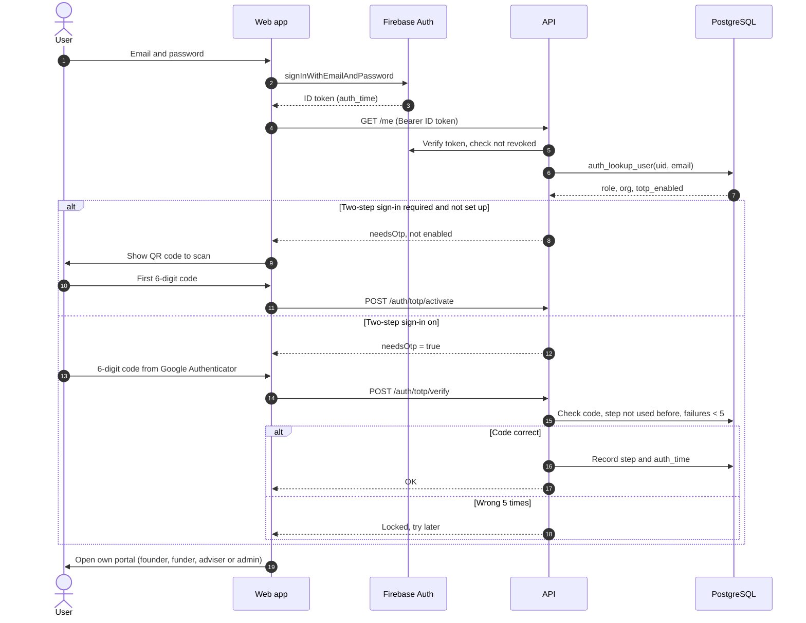
```mermaid
sequenceDiagram
  autonumber
  actor U as User
  participant W as Web app
  participant F as Firebase Auth
  participant A as API
  participant D as PostgreSQL

  U->>W: Email and password
  W->>F: signInWithEmailAndPassword
  F-->>W: ID token (auth_time)
  W->>A: GET /me (Bearer ID token)
  A->>F: Verify token, check not revoked
  A->>D: auth_lookup_user(uid, email)
  D-->>A: role, org, totp_enabled
  alt Two-step sign-in required and not set up
    A-->>W: needsOtp, not enabled
    W->>U: Show QR code to scan
    U->>W: First 6-digit code
    W->>A: POST /auth/totp/activate
  else Two-step sign-in on
    A-->>W: needsOtp = true
    U->>W: 6-digit code from Google Authenticator
    W->>A: POST /auth/totp/verify
    A->>D: Check code, step not used before, failures < 5
    alt Code correct
      A->>D: Record step and auth_time
      A-->>W: OK
    else Wrong 5 times
      A-->>W: Locked, try later
    end
  end
  W->>U: Open own portal (founder, funder, adviser or admin)
```

### 6.2 How every API request is authorised (two layers)

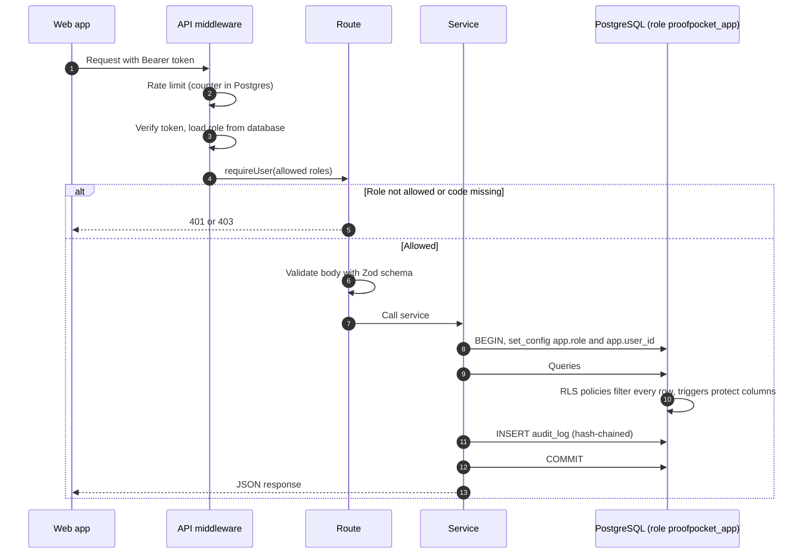
```mermaid
sequenceDiagram
  autonumber
  participant W as Web app
  participant M as API middleware
  participant R as Route
  participant S as Service
  participant D as PostgreSQL (role proofpocket_app)

  W->>M: Request with Bearer token
  M->>M: Rate limit (counter in Postgres)
  M->>M: Verify token, load role from database
  M->>R: requireUser(allowed roles)
  alt Role not allowed or code missing
    R-->>W: 401 or 403
  else Allowed
    R->>R: Validate body with Zod schema
    R->>S: Call service
    S->>D: BEGIN, set_config app.role and app.user_id
    S->>D: Queries
    D->>D: RLS policies filter every row, triggers protect columns
    S->>D: INSERT audit_log (hash-chained)
    S->>D: COMMIT
    S-->>W: JSON response
  end
```

### 6.3 Joining and document upload

Files go straight to private storage. The API checks the real file type and records a SHA-256 fingerprint.

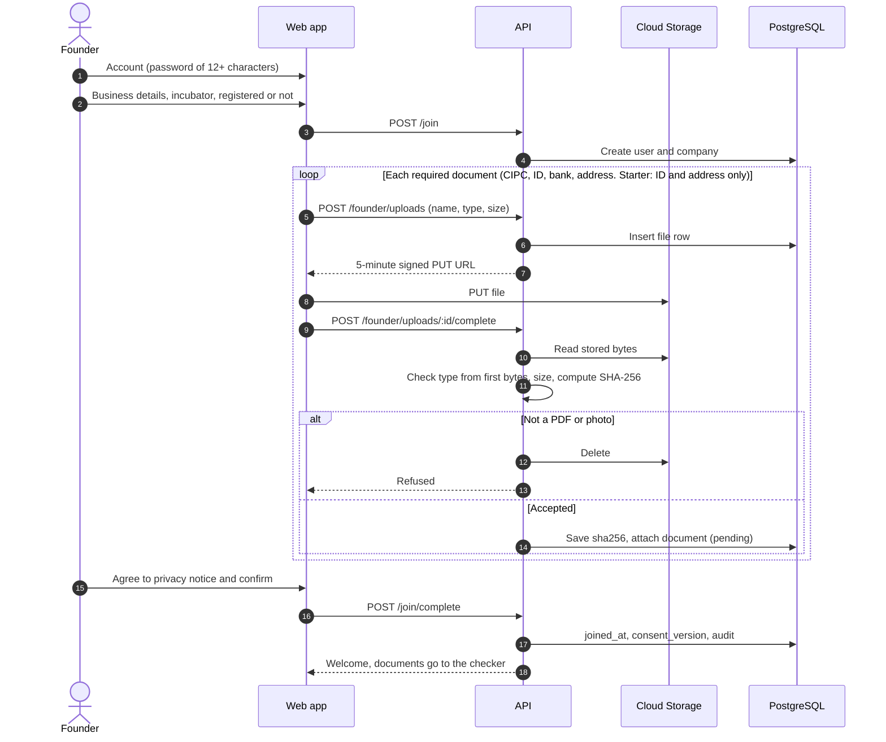
```mermaid
sequenceDiagram
  autonumber
  actor Fo as Founder
  participant W as Web app
  participant A as API
  participant B as Cloud Storage
  participant D as PostgreSQL

  Fo->>W: Account (password of 12+ characters)
  Fo->>W: Business details, incubator, registered or not
  W->>A: POST /join
  A->>D: Create user and company
  loop Each required document (CIPC, ID, bank, address. Starter: ID and address only)
    W->>A: POST /founder/uploads (name, type, size)
    A->>D: Insert file row
    A-->>W: 5-minute signed PUT URL
    W->>B: PUT file
    W->>A: POST /founder/uploads/:id/complete
    A->>B: Read stored bytes
    A->>A: Check type from first bytes, size, compute SHA-256
    alt Not a PDF or photo
      A->>B: Delete
      A-->>W: Refused
    else Accepted
      A->>D: Save sha256, attach document (pending)
    end
  end
  Fo->>W: Agree to privacy notice and confirm
  W->>A: POST /join/complete
  A->>D: joined_at, consent_version, audit
  A-->>W: Welcome, documents go to the checker
```

### 6.4 Document check and becoming Verified

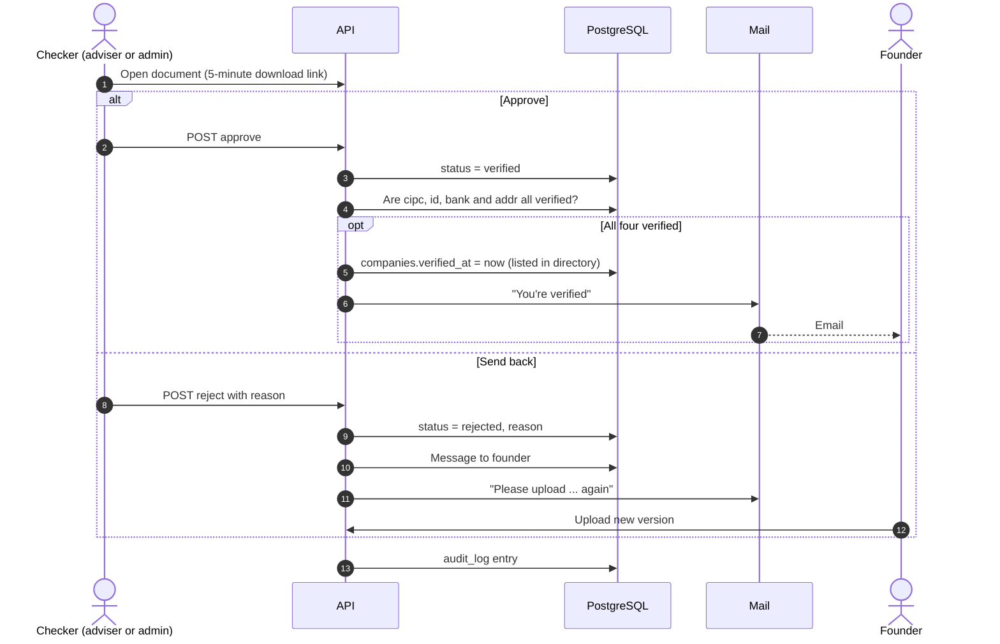
```mermaid
sequenceDiagram
  autonumber
  actor C as Checker (adviser or admin)
  participant A as API
  participant D as PostgreSQL
  participant Ma as Mail
  actor Fo as Founder

  C->>A: Open document (5-minute download link)
  alt Approve
    C->>A: POST approve
    A->>D: status = verified
    A->>D: Are cipc, id, bank and addr all verified?
    opt All four verified
      A->>D: companies.verified_at = now (listed in directory)
      A->>Ma: "You're verified"
      Ma-->>Fo: Email
    end
  else Send back
    C->>A: POST reject with reason
    A->>D: status = rejected, reason
    A->>D: Message to founder
    A->>Ma: "Please upload ... again"
    Fo->>A: Upload new version
  end
  A->>D: audit_log entry
```

### 6.5 Payment request, proof of payment and confirmation

ProofPocket never moves money. The client pays the founder directly, and only the founder's "The money is in my account" records income.

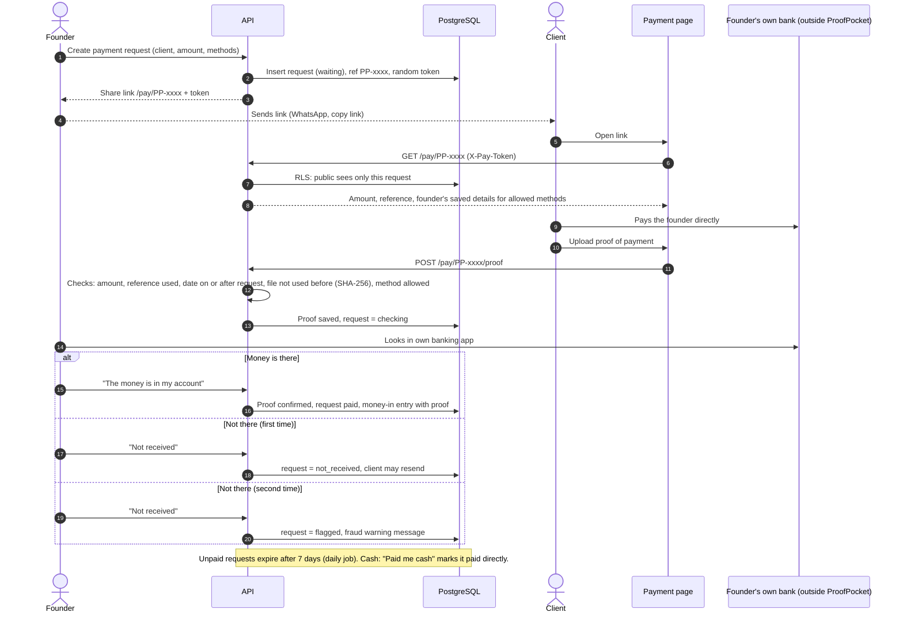
```mermaid
sequenceDiagram
  autonumber
  actor Fo as Founder
  participant A as API
  participant D as PostgreSQL
  actor Cl as Client
  participant P as Payment page
  participant Bank as Founder's own bank (outside ProofPocket)

  Fo->>A: Create payment request (client, amount, methods)
  A->>D: Insert request (waiting), ref PP-xxxx, random token
  A-->>Fo: Share link /pay/PP-xxxx + token
  Fo-->>Cl: Sends link (WhatsApp, copy link)
  Cl->>P: Open link
  P->>A: GET /pay/PP-xxxx (X-Pay-Token)
  A->>D: RLS: public sees only this request
  A-->>P: Amount, reference, founder's saved details for allowed methods
  Cl->>Bank: Pays the founder directly
  Cl->>P: Upload proof of payment
  P->>A: POST /pay/PP-xxxx/proof
  A->>A: Checks: amount, reference used, date on or after request, file not used before (SHA-256), method allowed
  A->>D: Proof saved, request = checking
  Fo->>Bank: Looks in own banking app
  alt Money is there
    Fo->>A: "The money is in my account"
    A->>D: Proof confirmed, request paid, money-in entry with proof
  else Not there (first time)
    Fo->>A: "Not received"
    A->>D: request = not_received, client may resend
  else Not there (second time)
    Fo->>A: "Not received"
    A->>D: request = flagged, fraud warning message
  end
  Note over A,D: Unpaid requests expire after 7 days (daily job). Cash: "Paid me cash" marks it paid directly.
```

### 6.6 Offline bookkeeping and sync

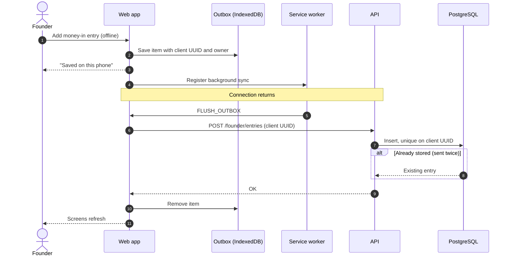
```mermaid
sequenceDiagram
  autonumber
  actor Fo as Founder
  participant W as Web app
  participant O as Outbox (IndexedDB)
  participant SW as Service worker
  participant A as API
  participant D as PostgreSQL

  Fo->>W: Add money-in entry (offline)
  W->>O: Save item with client UUID and owner
  W-->>Fo: "Saved on this phone"
  W->>SW: Register background sync
  Note over W,A: Connection returns
  SW->>W: FLUSH_OUTBOX
  W->>A: POST /founder/entries (client UUID)
  A->>D: Insert, unique on client UUID
  alt Already stored (sent twice)
    D-->>A: Existing entry
  end
  A-->>W: OK
  W->>O: Remove item
  W-->>Fo: Screens refresh
```

### 6.7 Funding: apply, offer and decision

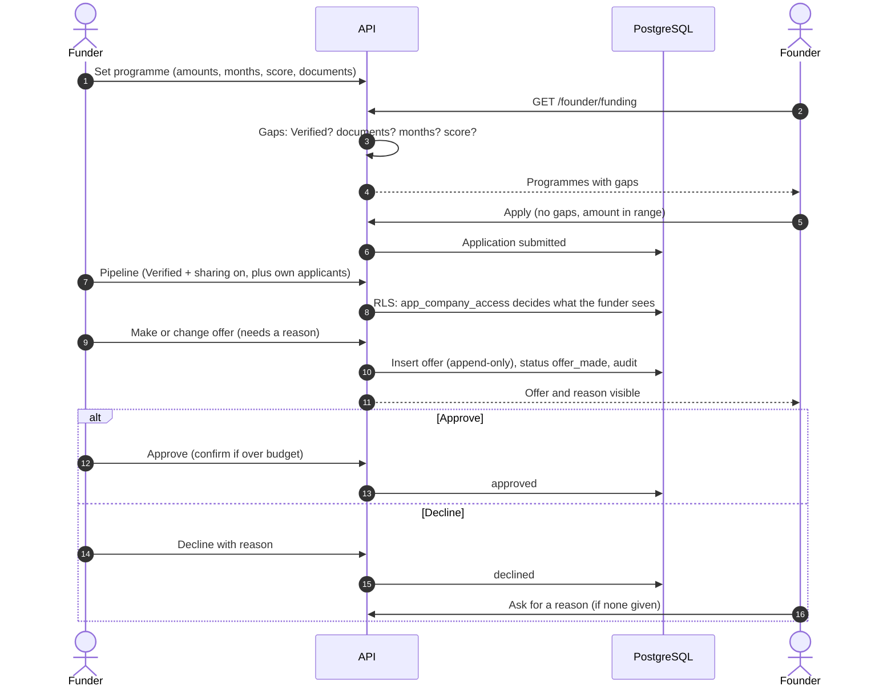
```mermaid
sequenceDiagram
  autonumber
  actor Fu as Funder
  participant A as API
  participant D as PostgreSQL
  actor Fo as Founder

  Fu->>A: Set programme (amounts, months, score, documents)
  Fo->>A: GET /founder/funding
  A->>A: Gaps: Verified? documents? months? score?
  A-->>Fo: Programmes with gaps
  Fo->>A: Apply (no gaps, amount in range)
  A->>D: Application submitted
  Fu->>A: Pipeline (Verified + sharing on, plus own applicants)
  A->>D: RLS: app_company_access decides what the funder sees
  Fu->>A: Make or change offer (needs a reason)
  A->>D: Insert offer (append-only), status offer_made, audit
  A-->>Fo: Offer and reason visible
  alt Approve
    Fu->>A: Approve (confirm if over budget)
    A->>D: approved
  else Decline
    Fu->>A: Decline with reason
    A->>D: declined
    Fo->>A: Ask for a reason (if none given)
  end
```

### 6.8 Changing payment details (protected)

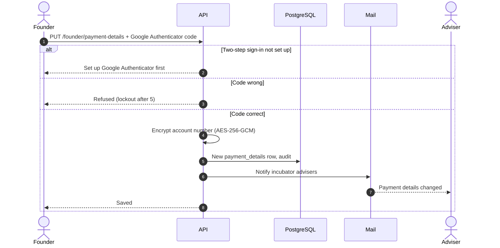
```mermaid
sequenceDiagram
  autonumber
  actor Fo as Founder
  participant A as API
  participant D as PostgreSQL
  participant Ma as Mail
  actor Ad as Adviser

  Fo->>A: PUT /founder/payment-details + Google Authenticator code
  alt Two-step sign-in not set up
    A-->>Fo: Set up Google Authenticator first
  else Code wrong
    A-->>Fo: Refused (lockout after 5)
  else Code correct
    A->>A: Encrypt account number (AES-256-GCM)
    A->>D: New payment_details row, audit
    A->>Ma: Notify incubator advisers
    Ma-->>Ad: Payment details changed
    A-->>Fo: Saved
  end
```

### 6.9 POPIA data request

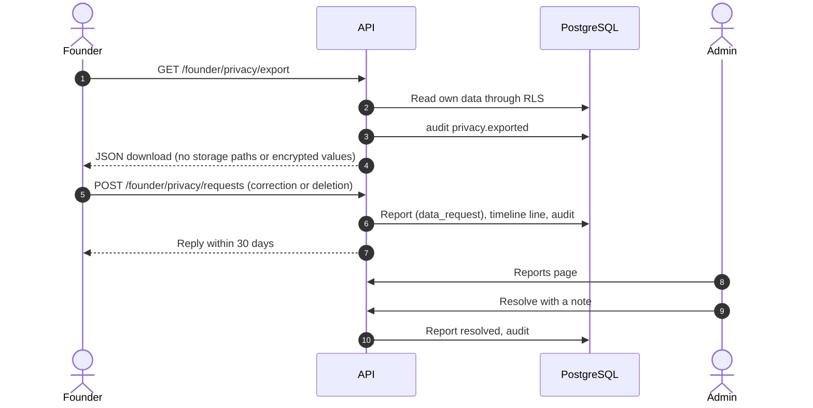
```mermaid
sequenceDiagram
  autonumber
  actor Fo as Founder
  participant A as API
  participant D as PostgreSQL
  actor Adm as Admin

  Fo->>A: GET /founder/privacy/export
  A->>D: Read own data through RLS
  A->>D: audit privacy.exported
  A-->>Fo: JSON download (no storage paths or encrypted values)
  Fo->>A: POST /founder/privacy/requests (correction or deletion)
  A->>D: Report (data_request), timeline line, audit
  A-->>Fo: Reply within 30 days
  Adm->>A: Reports page
  Adm->>A: Resolve with a note
  A->>D: Report resolved, audit
```

### 6.10 Daily scheduled job

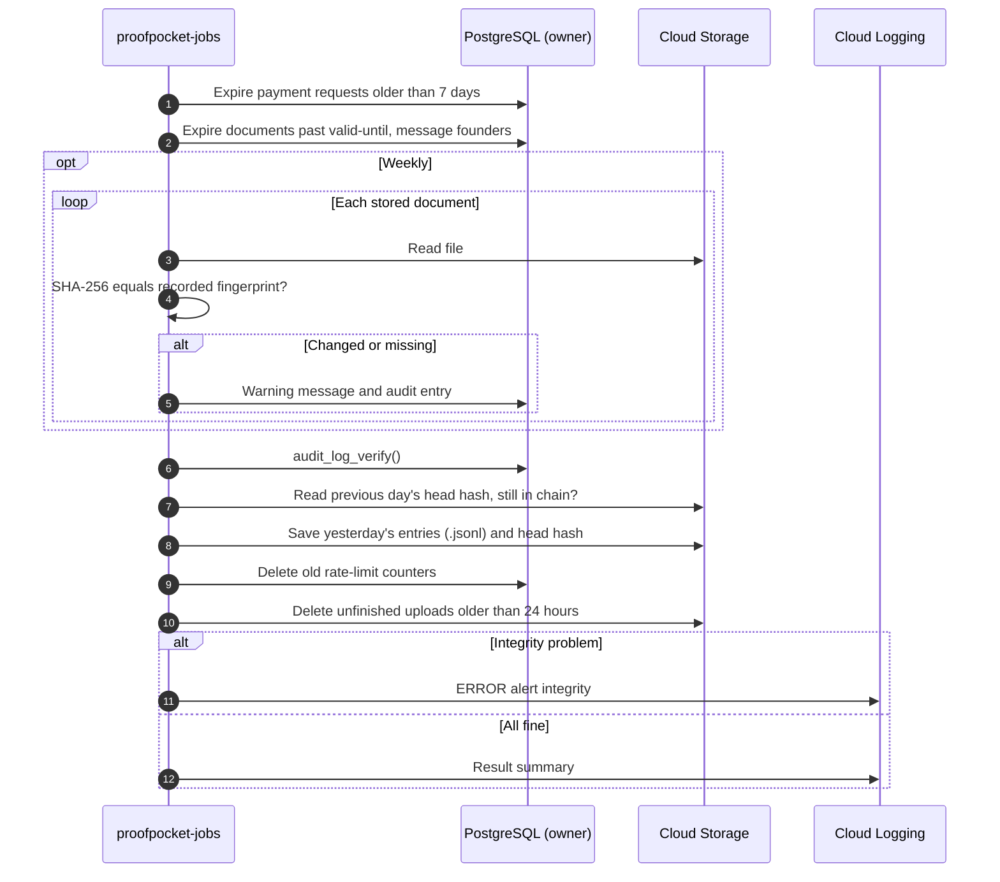
```mermaid
sequenceDiagram
  autonumber
  participant J as proofpocket-jobs
  participant D as PostgreSQL (owner)
  participant B as Cloud Storage
  participant L as Cloud Logging

  J->>D: Expire payment requests older than 7 days
  J->>D: Expire documents past valid-until, message founders
  opt Weekly
    loop Each stored document
      J->>B: Read file
      J->>J: SHA-256 equals recorded fingerprint?
      alt Changed or missing
        J->>D: Warning message and audit entry
      end
    end
  end
  J->>D: audit_log_verify()
  J->>B: Read previous day's head hash, still in chain?
  J->>B: Save yesterday's entries (.jsonl) and head hash
  J->>D: Delete old rate-limit counters
  J->>B: Delete unfinished uploads older than 24 hours
  alt Integrity problem
    J->>L: ERROR alert integrity
  else All fine
    J->>L: Result summary
  end
```

---

## 7. State machine diagrams

### 7.1 Payment request

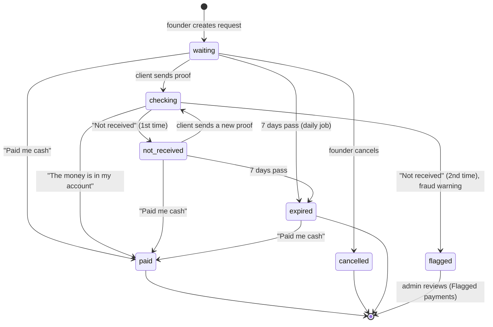
```mermaid
stateDiagram-v2
  [*] --> waiting : founder creates request
  waiting --> checking : client sends proof
  waiting --> paid : "Paid me cash"
  waiting --> cancelled : founder cancels
  waiting --> expired : 7 days pass (daily job)
  checking --> paid : "The money is in my account"
  checking --> not_received : "Not received" (1st time)
  checking --> flagged : "Not received" (2nd time), fraud warning
  not_received --> checking : client sends a new proof
  not_received --> expired : 7 days pass
  not_received --> paid : "Paid me cash"
  expired --> paid : "Paid me cash"
  paid --> [*]
  cancelled --> [*]
  expired --> [*]
  flagged --> [*] : admin reviews (Flagged payments)
```

### 7.2 Proof of payment

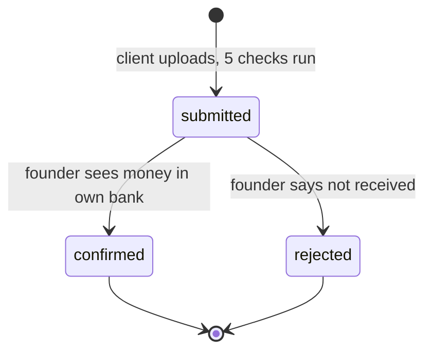
```mermaid
stateDiagram-v2
  [*] --> submitted : client uploads, 5 checks run
  submitted --> confirmed : founder sees money in own bank
  submitted --> rejected : founder says not received
  confirmed --> [*]
  rejected --> [*]
```

### 7.3 Document

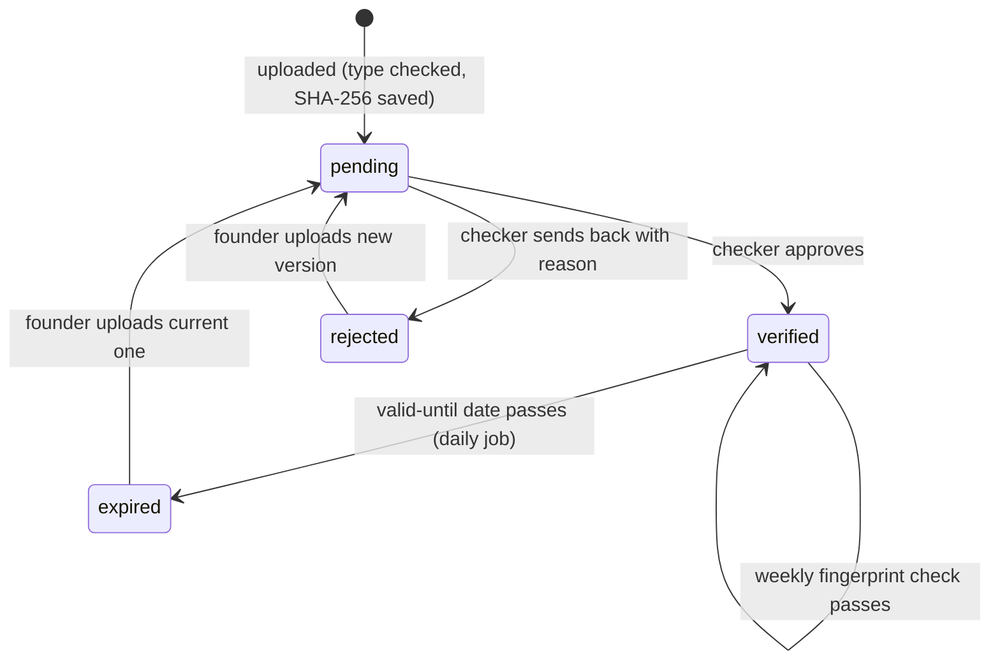
```mermaid
stateDiagram-v2
  [*] --> pending : uploaded (type checked, SHA-256 saved)
  pending --> verified : checker approves
  pending --> rejected : checker sends back with reason
  rejected --> pending : founder uploads new version
  verified --> expired : valid-until date passes (daily job)
  expired --> pending : founder uploads current one
  verified --> verified : weekly fingerprint check passes
```

### 7.4 Company verification

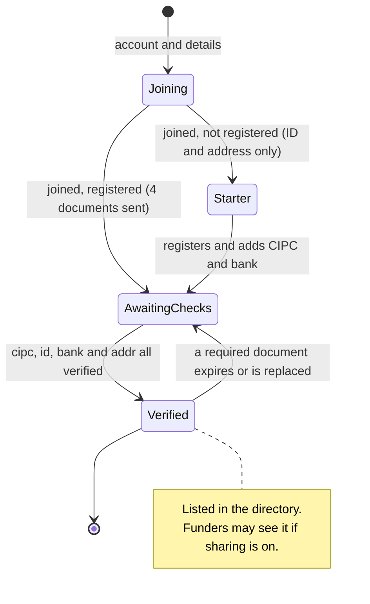
```mermaid
stateDiagram-v2
  [*] --> Joining : account and details
  Joining --> Starter : joined, not registered (ID and address only)
  Joining --> AwaitingChecks : joined, registered (4 documents sent)
  Starter --> AwaitingChecks : registers and adds CIPC and bank
  AwaitingChecks --> Verified : cipc, id, bank and addr all verified
  Verified --> AwaitingChecks : a required document expires or is replaced
  Verified --> [*]
  note right of Verified
    Listed in the directory.
    Funders may see it if sharing is on.
  end note
```

### 7.5 Funding application

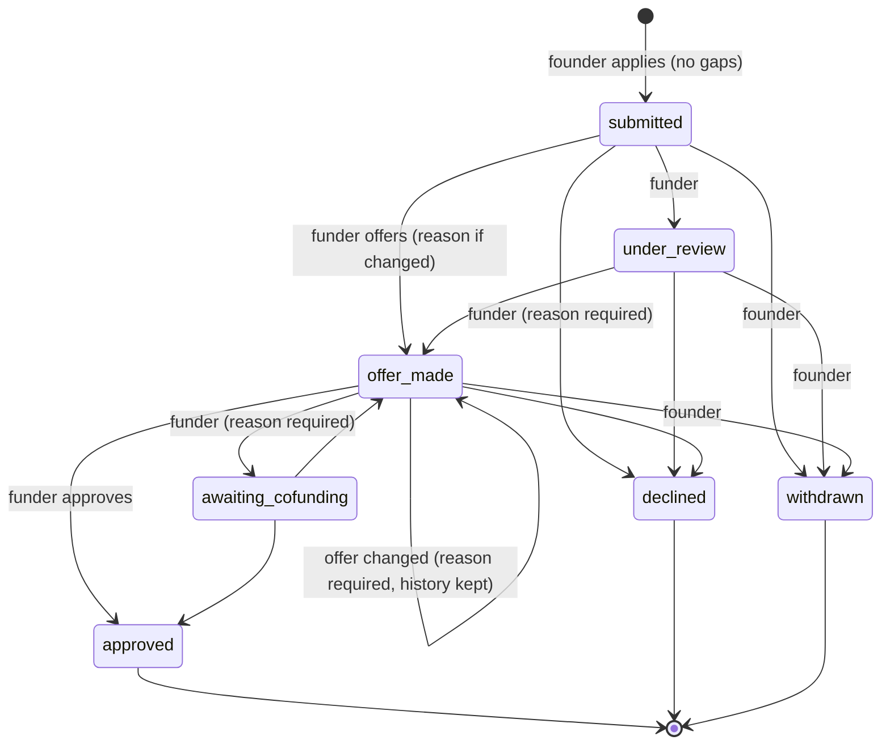
```mermaid
stateDiagram-v2
  [*] --> submitted : founder applies (no gaps)
  submitted --> under_review : funder
  submitted --> offer_made : funder offers (reason if changed)
  under_review --> offer_made
  offer_made --> offer_made : offer changed (reason required, history kept)
  offer_made --> awaiting_cofunding : funder (reason required)
  awaiting_cofunding --> offer_made
  offer_made --> approved : funder approves
  awaiting_cofunding --> approved
  submitted --> declined : funder (reason required)
  under_review --> declined
  offer_made --> declined
  submitted --> withdrawn : founder
  under_review --> withdrawn : founder
  offer_made --> withdrawn : founder
  approved --> [*]
  declined --> [*]
  withdrawn --> [*]
```

### 7.6 Incubator membership

```mermaid
stateDiagram-v2
  [*] --> requested : founder asks to join
  requested --> active : incubator accepts
  requested --> declined : incubator declines
  active --> left : founder leaves or moves
  declined --> [*]
  left --> [*]
```

### 7.7 Supplier bank detail change

```mermaid
stateDiagram-v2
  [*] --> pending : new bank details entered
  pending --> confirmed : founder confirms
  pending --> rejected : founder rejects
  confirmed --> [*]
  rejected --> [*]
  note right of pending
    Payments to this supplier
    are blocked while pending.
  end note
```

### 7.8 Post feature request

```mermaid
stateDiagram-v2
  [*] --> none : post saved
  none --> requested : Verified founder asks for a feature
  requested --> featured : admin approves (7 days)
  requested --> rejected : admin rejects with note
  featured --> [*]
  rejected --> [*]
```

### 7.9 Report and data request

```mermaid
stateDiagram-v2
  [*] --> open : public, client or founder reports (or founder sends a data request)
  open --> resolved : admin acts, adds note
  open --> dismissed : admin dismisses, adds note
  resolved --> [*]
  dismissed --> [*]
```

---

## 8. Activity diagrams

### 8.1 Readiness score (computed on the server only)

```mermaid
flowchart TD
  S([Start]) --> A0[score = 0]
  A0 --> D1{CIPC verified?} -->|yes| P1[+15] --> D2
  D1 -->|no| D2{Owner ID verified?}
  D2 -->|yes| P2[+5] --> D3
  D2 -->|no| D3{Bank letter verified?}
  D3 -->|yes| P3[+10] --> D4
  D3 -->|no| D4{Tax verified?}
  D4 -->|yes| P4[+15] --> D5
  D4 -->|no| D5{Business plan verified?}
  D5 -->|yes| P5[+10] --> D6
  D5 -->|no| D6{Signed management accounts verified?}
  D6 -->|yes| P6[+15] --> D7
  D6 -->|no| D7{Books updated in last 7 days?}
  D7 -->|yes| P7[+10] --> D8
  D7 -->|no| D8{No unresolved personal purchases?}
  D8 -->|yes| P8[+10] --> D9
  D8 -->|no| D9{An Owner salary entry?}
  D9 -->|yes| P9[+5] --> D10
  D9 -->|no| D10{Six months of records?}
  D10 -->|yes| P10[+5] --> R
  D10 -->|no| R{score}
  R -->|70 or more| L1[Funding ready]
  R -->|45 to 69| L2[Getting there]
  R -->|below 45| L3[Early]
  L1 --> E([End])
  L2 --> E
  L3 --> E
```

### 8.2 Applying to a funding programme

```mermaid
flowchart TD
  S([Founder opens Funding readiness]) --> G[Server works out gaps for each open programme]
  G --> V{Company Verified?}
  V -->|no| Gap[Show gap: get Verified]
  V -->|yes| Docs{All required documents verified?}
  Docs -->|no| Gap2[Show gap: missing documents]
  Docs -->|yes| M{Enough months of records?}
  M -->|no| Gap3[Show gap: more months]
  M -->|yes| Sc{Score at least the minimum?}
  Sc -->|no| Gap4[Show gap: raise score]
  Sc -->|yes| Amt[/Founder enters amount/]
  Amt --> R{Amount within min and max?}
  R -->|no| Err[Ask for an amount in range]
  Err --> Amt
  R -->|yes| Sub[Create application: submitted]
  Sub --> Share[Funder can now see the profile at summary level]
  Share --> E([End])
  Gap --> E
  Gap2 --> E
  Gap3 --> E
  Gap4 --> E
```

### 8.3 Recording a money-out entry

```mermaid
flowchart TD
  S([Founder adds Money out]) --> V[Validate amount, date, method, category]
  V --> Sup{Paid to a supplier?}
  Sup -->|yes| Hold{Supplier bank details pending?}
  Hold -->|yes| Block[Blocked until confirmed or rejected] --> E([End])
  Hold -->|no| Dup
  Sup -->|no| Dup{Same amount paid out in the last 7 days?}
  Dup -->|yes| Conf{Founder chooses Save anyway?}
  Conf -->|no| E
  Conf -->|yes| Save
  Dup -->|no| Save[Save entry with client UUID]
  Save --> Stock{Linked to stock?}
  Stock -->|yes| Move[Move stock quantity]
  Stock -->|no| Pers
  Move --> Pers{Marked personal?}
  Pers -->|yes| Flag[Counts against readiness until Paid back]
  Pers -->|no| Done[Update books, cash flow and readiness]
  Flag --> Done
  Done --> E
```
